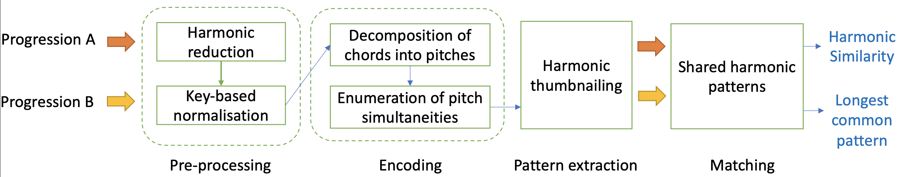
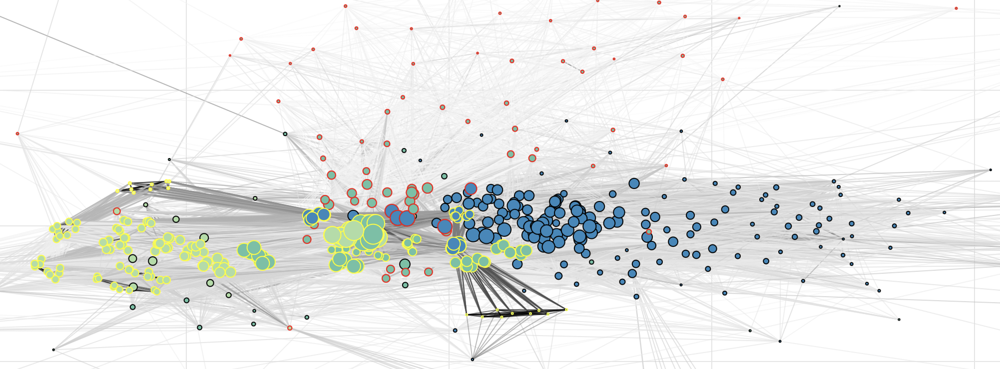

# Local Harmonic Agreement based on Recurrent Patterns (LHARP)

A novel method for harmonic similarity that emphasises shared repeated patterns among symbolic chord sequences, to accommodate a wide set of applications. Compared to other harmonic similarity methods on symbolic music, LHARP enables more explorative studies, as it can establish links when local harmonic patterns are found repeated in both sequences, while retaining global information to a lesser extent. This is also complemented with *"The Harmonic Network"* a computational tool allowing users to explore music collections by visualising harmonic similarities among tracks and interacting with the resulting graph to discover nontrivial relationships among authors, composers, and pieces.

<p align="center">

</p>


## Introduction to LHARP

The proposed harmonic similarity in this chapter is formulated in a way to emphasise shared repeated patterns among two arbitrary symbolic sequences, hence it provides a general framework for the analysis of symbolic streams based on their local structures. 
As illustrated in the diagram above, the domain-specific parts are the pre-processing and encoding steps, whereas the downstream part of the pipeline -- including pattern extraction and matching operations, can generalise to arbitrary symbolic (uni-modal) sequences.


1. **Harmonic reduction.** Chord progression are simplified before comparison – the bass note is removed as this operation improves the generalisation capabilities of the next steps, thereby producing more consistent similarity scores), and consecutively repeated chords are removed. This provides a "bird’s eye view" on the global harmonic properties of each piece.

2. **Key-based normalisation.** Chords labels/classes in a progression need to be contextualised according to the key of the piece (defined by the tonic and the scale) before any comparison is possible. Therefore, all chord progressions are transposed to the same key: C major. This last transformation concludes the pre-processing operations.

3. **Decomposition of chords.** The normalised harmonic sequences are then prepared for the encoding step, so that they can be used as input to the any computational procedure. Rather than further simplifying the symbolic musical content, a new encoding procedure was designed to retain the fundamental internal structure of each chord. More precisely, every chord label is decomposed into its pitch constituents – the individual pitches it is made of. For example, a C major is encoded as a multi-hot vector where the elements corresponding to the active pitches are equal to 1; all the others are 0.

4. **Enumeration of pitch simultaneities.** To reduce the complexity of any potential polyphonic model using such sparse local representations of chords, each unique decomposition is then assigned to an index (an integer value). As it can be observed, this is akin to the common encoding approach used in natural language processing for word tokens. This results into *chord tokens* defined over the vocabulary of all possible chord decompositions.

5. **Harmonic thumbnailing.** To identify the areas/regions of chord progressions that can be deemed as "harmonically memorable", we extract the n-grams of all possible orders -- starting from tri-grams, that repeat at least once within the progression. We call them "harmonic thumbnails", as they represent harmonic structures per se.

6. **Shared harmonic patterns.** Finally, chord progressions are compared for similarity based on the agreement between their harmonic thumbnails. In particular, the longest harmonic structures they share is compared to the order of the longest thumbnail that occurs within each progression, independently. Therefore, depending on the harmonic patterns the two chord progressions have in common -- in relation to their internal structures, the similarity function will return a value between 0 and 1 (the higher the value, the stronger the similarity) together with the longest harmonic patterns they share.

## The Harmonic Network

<p align="center">

</p>

As illustrated in the figure above, in the harmonic network nodes correspond to tracks in chord music datasets, whereas edges connect nodes if their value of harmonic similarity is greater than 0 (an harmonic match was found).
To simplify the inspection, a grey-scale colourmap visually projects the value of harmonic similarity expressed by edges: from light grey (low similarity) to plain black (high similarity).
Instead, nodes are sized according to their degree -- the number of connections/edges they have. As the graph is undirected, considering that similarity is symmetric by definition, the degree is equal to the number of tracks sharing harmonic structures.
A distinct border colour also differentiate nodes according to the music dataset they come from.
The harmonic network also provides features for the exploration of the graph; a demo LIVE version can be found [at this link](https://polifonia-project.github.io/musilar-preview/).

# Setup

All required packages and dependencies are listed in the ``requirements.txt`` file. To setup your environment, just create a new virtualenv or conda environment from your local system, clone this repository, and install all dependencies by running the following command.
```
git clone https://github.com/polifonia-project/lharp.git && cd lharp
pip install -r ./requirements.txt
```
You are ready to use LHARP, please check the documentation, and our examples/demos.


# Attribution

Please, cite this paper if you use the code in this repository as part of a published research project:

```
inproceedings{deberardinis2021lharp,
  title={A local harmonic similarity function based on shared repeated chord structures},
  author={de Berardinis, Jacopo and Meroño-Peñuela, Albert and Poltronieri, Andrea and Presutti, Valentina},
  booktitle={Manuscript under review},
  year={2021}
}
```

# License

MIT License

Copyright (c) 2021 Jacopo de Berardinis, Albert Meroño-Peñuela, Andrea Poltronieri, Valentina Presutti

Permission is hereby granted, free of charge, to any person obtaining a copy of this software and associated documentation files (the "Software"), to deal in the Software without restriction, including without limitation the rights to use, copy, modify, merge, publish, distribute, sublicense, and/or sell copies of the Software, and to permit persons to whom the Software is furnished to do so, subject to the following conditions:

The above copyright notice and this permission notice shall be included in all copies or substantial portions of the Software.

THE SOFTWARE IS PROVIDED "AS IS", WITHOUT WARRANTY OF ANY KIND, EXPRESS OR IMPLIED, INCLUDING BUT NOT LIMITED TO THE WARRANTIES OF MERCHANTABILITY, FITNESS FOR A PARTICULAR PURPOSE AND NONINFRINGEMENT. IN NO EVENT SHALL THE AUTHORS OR COPYRIGHT HOLDERS BE LIABLE FOR ANY CLAIM, DAMAGES OR OTHER LIABILITY, WHETHER IN AN ACTION OF CONTRACT, TORT OR OTHERWISE, ARISING FROM, OUT OF OR IN CONNECTION WITH THE SOFTWARE OR THE USE OR OTHER DEALINGS IN THE SOFTWARE.